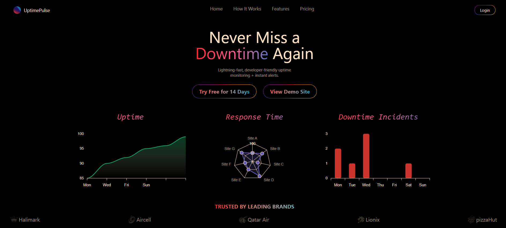

# 🌐 UptimePulse

**UptimePulse** is a full-stack SaaS application to monitor website uptime and performance in real-time. Get alerts, logs, charts, and insights—powered by modern tech and a clean, responsive UI.

## 🚀 Live Demo

👉 [Live Demo](https://uptimepulse.vercel.app/)

## 🖼️ Preview

**Landing Page View:**  


**Dashboard View:**  


## 🔧 Tech Stack

**Frontend:**

- React
- Tailwind CSS
- ApexCharts
- Clerk (Authentication)

**Backend:**

- Node.js
- Express
- MongoDB + Mongoose
- Stripe (Payments)
- Nodemailer (Email alerts)

## ✨ Features

- ✅ **Monitor URLs** — Add, update, and delete URLs to monitor.
- 📈 **Real-Time Status** — See if sites are Up, Slow, or Down.
- ⏱️ **Response Time & Check Interval** — Based on your subscription plan.
- 📬 **Email Alerts** — Get notified when your site goes down.
- 🔐 **Authentication with Clerk** — Secure and modern login system.
- 💳 **Stripe Integration** — Subscription-based pricing model.
- 📊 **Charts & Logs** — Beautiful UI showing response times and status logs.
- 🧠 **Dashboard** — Overview of your monitors and their performance.

## 🧪 Test Credentials

Due to Clerk's real email verification, test credentials are not available.  
However, you can sign up using your own email to explore the app.

## 📁 Folder Structure

```
Craftsy/
├── Backend/
│ ├── src/
│ ├── controllers/
│ ├── libs/
│ ├── models/
│ ├── routes/
│ └── index.js/
│
├── Frontend/
│ ├── src/
│ ├── pages/
│ └── App.jsx
│
├── screenshots/
│
└── README.md
```

## 📄 License

This project is licensed under the MIT License.

## 📬 Contact

Created by Sarit Bose

- 📩 saritbose26@gmail.com
- 🔗 [LinkedIn](https://linkedin.com/in/sarit-bose)

## 📝 Note

**If anything is not working, just reload the page and be patient.**  
Deployment platforms might cause minor cold start delays.
